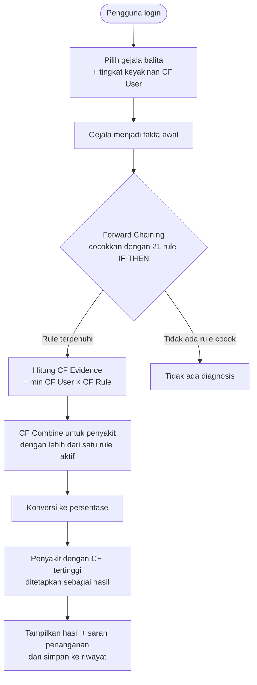

<div align="center">

# 🩺 Sistem Pakar Diagnosis ISPA pada Balita

### Berbasis Website dengan Metode *Forward Chaining* dan *Certainty Factor*


*Proyek Skripsi S-1 Sistem Informasi — Institut Teknologi dan Bisnis Ahmad Dahlan Jakarta, 2026*

</div>

---

## 📑 Daftar Isi

- [Tentang Proyek](#-tentang-proyek)
- [Latar Belakang](#-latar-belakang)
- [Tujuan Penelitian](#-tujuan-penelitian)
- [Fitur Utama](#-fitur-utama)
- [Cakupan Penyakit & Gejala](#-cakupan-penyakit--gejala)
- [Cara Kerja Sistem](#-cara-kerja-sistem)
- [Basis Pengetahuan & Rule](#-basis-pengetahuan--rule)
- [Metode Certainty Factor](#-metode-certainty-factor)
- [Contoh Perhitungan](#-contoh-perhitungan)
- [Arsitektur & Teknologi](#-arsitektur--teknologi)
- [Perancangan Database](#-perancangan-database)
- [Pemodelan Sistem (UML)](#-pemodelan-sistem-uml)
- [Tampilan Aplikasi](#-tampilan-aplikasi)
- [Instalasi & Menjalankan](#-instalasi--menjalankan)
- [Hasil Pengujian](#-hasil-pengujian)
- [Keterbatasan & Pengembangan Selanjutnya](#-keterbatasan--pengembangan-selanjutnya)
- [Disclaimer Medis](#️-disclaimer-medis)
- [Penulis](#-penulis)
- [Sitasi](#-sitasi)

---

## 📖 Tentang Proyek

**Sistem Pakar Diagnosis ISPA pada Balita** adalah aplikasi berbasis web yang membantu orang tua atau wali melakukan **diagnosis awal** Infeksi Saluran Pernapasan Akut (ISPA) bagian **saluran pernapasan bawah** pada balita, berdasarkan gejala yang dialami anak.

Sistem menyimpan pengetahuan seorang dokter spesialis anak dalam bentuk *knowledge base* dan *rule base* (IF–THEN). Penalaran dilakukan dengan **Forward Chaining**, sedangkan tingkat keyakinan hasil diagnosis dihitung dengan **Certainty Factor (CF)**. Hasil akhirnya berupa nama penyakit, persentase keyakinan, dan saran penanganan awal.

> Proyek ini merupakan bagian dari skripsi berjudul **"Perancangan Sistem Pakar Diagnosis Penyakit ISPA pada Balita Berbasis Website Menggunakan Metode Forward Chaining dan Certainty Factor"**.

---

## 🎯 Latar Belakang

ISPA merupakan salah satu penyebab utama kematian pada balita di Indonesia. Dua hal memperburuk keadaan:

- Orang tua kurang memahami **gejala awal** ISPA.
- **Akses konsultasi** dengan tenaga medis terbatas, sehingga penanganan sering terlambat.

Sistem pakar ini dirancang agar orang tua bisa memperoleh informasi dan diagnosis awal secara **cepat, praktis, dan mandiri** sebelum memeriksakan anak ke tenaga medis.

---

## ✅ Tujuan Penelitian

1. Merancang sistem pakar berbasis web untuk diagnosis awal ISPA pada balita berdasarkan gejala.
2. Menerapkan metode *Forward Chaining* dan *Certainty Factor* untuk menentukan kemungkinan penyakit beserta tingkat keyakinannya.
3. Mengimplementasikan sistem sebagai media informasi awal bagi masyarakat.
4. Menguji sistem agar berjalan sesuai fungsi yang diharapkan dalam memberikan diagnosis awal.

---

## ✨ Fitur Utama

### 👨‍👩‍👧 Sisi Pengguna (Orang Tua / Wali)

| Fitur | Deskripsi |
|-------|-----------|
| **Landing Page** | Informasi tujuan sistem, penjelasan metode, dan tombol untuk memulai konsultasi |
| **Registrasi & Login** | Pendaftaran akun (nama lengkap, email, username, password) dan masuk ke sistem |
| **Dashboard User** | Sapaan personal, akses cepat ke konsultasi, dan ringkasan riwayat diagnosis terakhir |
| **Konsultasi** | Memilih gejala yang dialami balita beserta **tingkat keyakinan** (tidak yakin → sangat yakin) |
| **Hasil Diagnosis** | Nama penyakit, nilai CF, persentase keyakinan, tanggal diagnosis, dan kriteria kepastian (Rendah / Sedang / Tinggi) |
| **Saran Penanganan** | Rekomendasi penanganan awal sesuai penyakit hasil diagnosis |
| **Riwayat Diagnosis** | Daftar seluruh konsultasi sebelumnya, dengan akses ke detail |
| **Cetak Hasil** | Pratinjau cetak laporan diagnosis ke dokumen/PDF sebagai arsip pribadi |
| **Profil User** | Ubah foto profil, data diri, dan password |

### 🛠️ Sisi Administrator

| Fitur | Deskripsi |
|-------|-----------|
| **Login Admin** | Autentikasi khusus administrator |
| **Dashboard Admin** | Ringkasan total penyakit, gejala, rule, pengguna, serta grafik tren diagnosis |
| **Kelola Penyakit** | Tambah, ubah, hapus, dan cari data penyakit (kode, nama, deskripsi, gejala umum, penanganan) |
| **Kelola Gejala** | Tambah, ubah, hapus, dan cari data gejala, dilengkapi pagination |
| **Kelola Rule** | Membuat rule dengan memilih penyakit, satu atau beberapa gejala (checkbox), dan nilai CF pakar |
| **Kelola Nilai CF** | Memperbarui bobot keyakinan pakar sesuai perkembangan pengetahuan medis |
| **Kelola Pengguna** | Melihat dan menghapus akun yang terdaftar |
| **Riwayat Diagnosis** | Memantau seluruh hasil konsultasi, dengan filter tanggal dan jenis penyakit |

---

## 🦠 Cakupan Penyakit & Gejala

### Penyakit (ISPA Saluran Pernapasan Bawah)

| Kode | Penyakit | Keterangan Singkat |
|------|----------|--------------------|
| **P01** | Laringitis | Peradangan pada laring atau pita suara |
| **P02** | Bronkitis | Peradangan pada bronkus, disertai produksi lendir berlebih |
| **P03** | Bronkiolitis | Peradangan atau penyumbatan saluran napas kecil, umumnya akibat RSV |
| **P04** | Pneumonia | Infeksi akut pada alveoli paru-paru |

### Gejala (24 gejala)

<details>
<summary><b>Klik untuk melihat daftar lengkap gejala</b></summary>

| Kode | Gejala | Kode | Gejala |
|------|--------|------|--------|
| G01 | Flu atau bersin-bersin | G13 | Napas berbunyi (stridor) |
| G02 | Tenggorokan kering | G14 | Batuk berdahak |
| G03 | Demam tinggi atau menggigil | G15 | Napas berbunyi mengi (wheezing) |
| G04 | Hidung tersumbat | G16 | Napas lebih cepat dari biasanya |
| G05 | Suara serak | G17 | Tampak rewel atau lemas (letargi) |
| G06 | Suara hilang | G18 | Nafsu makan menurun |
| G07 | Batuk | G19 | Tarikan dinding dada bagian bawah lebih dalam |
| G08 | Sakit tenggorokan | G20 | Sulit minum atau menyusu |
| G09 | Sulit menelan | G21 | Bibir atau kuku kebiruan (sianosis) |
| G10 | Nyeri saat menelan | G22 | Penurunan kesadaran (delirium) |
| G11 | Demam | G23 | Kejang |
| G12 | Sesak napas atau tarikan napas lebih berat | G24 | Nyeri dada saat batuk |

</details>

> Basis pengetahuan bersumber dari **wawancara dengan dokter spesialis anak (dr. Kartika Sari Widuri, Sp.A., IBCLC)** dan studi literatur medis.

---

## ⚙️ Cara Kerja Sistem



**Langkah ringkas:**

1. Pengguna memilih gejala yang dialami balita pada halaman konsultasi.
2. Gejala yang dipilih menjadi **fakta awal** (*evidence*).
3. **Forward Chaining** mencocokkan fakta dengan rule IF–THEN untuk menghasilkan kandidat penyakit.
4. **Certainty Factor** menghitung tingkat keyakinan tiap kandidat.
5. Penyakit dengan CF tertinggi menjadi hasil diagnosis.
6. Sistem menampilkan nama penyakit, persentase keyakinan, gejala terpilih, serta saran penanganan awal.

---

## 📚 Basis Pengetahuan & Rule

Basis aturan memuat **21 rule** (R1–R21) dalam bentuk `IF gejala AND gejala ... THEN penyakit`, masing-masing dengan nilai **CF Rule** dari pakar.

<details>
<summary><b>Klik untuk melihat daftar 21 rule</b></summary>

| Rule | IF (Gejala) | THEN | CF Rule |
|------|-------------|------|---------|
| R1 | G02 ∧ G05 ∧ G06 | P01 Laringitis | 1.0 |
| R2 | G05 ∧ G07 ∧ G08 ∧ G09 | P01 Laringitis | 0.8 |
| R3 | G07 ∧ G10 ∧ G11 ∧ G13 | P01 Laringitis | 0.8 |
| R4 | G01 ∧ G03 ∧ G04 | P01 Laringitis | 0.6 |
| R5 | G03 ∧ G12 ∧ G24 | P01 Laringitis | 0.8 |
| R6 | G01 ∧ G07 ∧ G11 | P02 Bronkitis | 0.6 |
| R7 | G07 ∧ G11 ∧ G14 | P02 Bronkitis | 0.8 |
| R8 | G14 ∧ G15 ∧ G16 | P02 Bronkitis | 1.0 |
| R9 | G15 ∧ G16 ∧ G17 ∧ G18 | P02 Bronkitis | 0.8 |
| R10 | G07 ∧ G12 ∧ G16 | P02 Bronkitis | 0.6 |
| R11 | G01 ∧ G04 ∧ G07 | P03 Bronkiolitis | 0.6 |
| R12 | G07 ∧ G11 ∧ G12 | P03 Bronkiolitis | 0.8 |
| R13 | G12 ∧ G15 ∧ G16 | P03 Bronkiolitis | 1.0 |
| R14 | G16 ∧ G17 ∧ G18 | P03 Bronkiolitis | 0.8 |
| R15 | G19 ∧ G20 ∧ G21 | P03 Bronkiolitis | 1.0 |
| R16 | G03 ∧ G07 ∧ G11 | P04 Pneumonia | 0.8 |
| R17 | G07 ∧ G12 ∧ G15 ∧ G16 | P04 Pneumonia | 1.0 |
| R18 | G16 ∧ G17 ∧ G18 ∧ G19 | P04 Pneumonia | 0.8 |
| R19 | G19 ∧ G20 ∧ G21 | P04 Pneumonia | 1.0 |
| R20 | G12 ∧ G19 ∧ G22 | P04 Pneumonia | 1.0 |
| R21 | G19 ∧ G21 ∧ G23 | P04 Pneumonia | 0.8 |

</details>

---

## 🧮 Metode Certainty Factor

### Skala keyakinan

Nilai CF Pakar dan CF User memakai skala yang sama:

| Pernyataan | Nilai CF |
|------------|:--------:|
| Sangat yakin | 1.0 |
| Yakin | 0.8 |
| Cukup yakin | 0.6 |
| Sedikit yakin | 0.4 |
| Kurang yakin | 0.2 |
| Tidak yakin | 0.0 |

### Rumus

**1. CF Evidence** (operator AND): ambil nilai CF User terkecil dari gejala pada rule.

```
CF Evidence = MIN(CF User gejala 1, CF User gejala 2, ..., CF User gejala n)
```

**2. CF Rule aktif**: kalikan CF Evidence dengan CF Rule. Hasilnya menjadi *fakta baru* untuk penyakit terkait.

```
CF(rule) = CF Evidence × CF Rule
```

**3. CF Combine**: bila satu penyakit punya lebih dari satu rule aktif, nilainya digabung secara berurutan.

```
CF Combine = CF_lama + CF_baru × (1 − CF_lama)
```

**4. Persentase keyakinan**

```
Persentase = CF Combine × 100%
```

---

## 🔢 Contoh Perhitungan

Contoh dari skripsi: pengguna memilih gejala **G07, G11, G12, G14, G15, G16, G17, G18, G19, G20, G21** dengan CF User sebagai berikut.

| Gejala | CF User | | Gejala | CF User |
|--------|:-------:|-|--------|:-------:|
| G07 Batuk | 1.0 | | G17 Rewel/lemas | 0.8 |
| G11 Demam | 0.8 | | G18 Nafsu makan menurun | 0.6 |
| G12 Sesak napas | 1.0 | | G19 Tarikan dinding dada | 1.0 |
| G14 Batuk berdahak | 0.8 | | G20 Sulit minum/menyusu | 0.8 |
| G15 Mengi | 0.8 | | G21 Sianosis | 1.0 |
| G16 Napas cepat | 1.0 | | | |

Contoh satu rule, **R7** (G07, G11, G14 → Bronkitis, CF Rule 0.8):

```
CF Evidence = MIN(1.0 ; 0.8 ; 0.8) = 0.8
CF(R7)      = 0.8 × 0.8 = 0.64   →  fakta baru untuk P02
```

Setelah semua rule aktif dihitung dan digabung dengan CF Combine, hasilnya:

| Kode | Penyakit | Manual | Sistem |
|------|----------|:------:|:------:|
| P02 | Bronkitis | 98,50% | 98,50% |
| **P03** | **Bronkiolitis** | **99,25%** | **99,25%** |
| P04 | Pneumonia | 97,92% | 97,92% |

Hasil perhitungan manual sama dengan hasil sistem, jadi **Bronkiolitis (P03)** dengan CF tertinggi menjadi hasil diagnosis.

---

## 🏗️ Arsitektur & Teknologi

Aplikasi ini dikembangkan dengan model **Waterfall**: analisis kebutuhan → perancangan → implementasi → pengujian → pemeliharaan.

### Komponen sistem pakar

| Komponen | Peran |
|----------|-------|
| **Basis Pengetahuan** | Data penyakit, gejala, CF pakar, dan solusi penanganan dari pakar |
| **Basis Aturan** | 21 rule IF–THEN yang menghubungkan gejala dengan penyakit |
| **Mesin Inferensi** | Forward Chaining untuk penalaran dan Certainty Factor untuk menghitung keyakinan |
| **Basis Data** | MySQL untuk data pengguna, penyakit, gejala, rule, hasil, dan riwayat |
| **Antarmuka** | Web (HTML, CSS, JavaScript, PHP) |

### Tech stack

| Kategori | Teknologi |
|----------|-----------|
| Bahasa pemrograman | PHP, JavaScript |
| Antarmuka | HTML5, CSS3 |
| Database | MySQL (dikelola dengan phpMyAdmin) |
| Web server lokal | XAMPP (Apache + MySQL) |
| Editor | Visual Studio Code |
| Pemodelan | Draw.io (UML & ERD) |
| Pengujian | Blackbox Testing, validasi pakar |

---

## 🗄️ Perancangan Database

Database MySQL terdiri dari tabel-tabel berikut:

| Tabel | Fungsi | Field Utama |
|-------|--------|-------------|
| `user` | Akun pengguna dan admin | `id_user`, `nama_lengkap`, `username`, `email`, `password`, `no_hp`, `alamat`, `foto`, `role` |
| `admin` | Data administrator | — |
| `penyakit` | Data penyakit | `id_penyakit`, `kode_penyakit`, `nama_penyakit`, `deskripsi`, `gejala_umum`, `penanganan`, `gambar` |
| `gejala` | Daftar gejala | `id_gejala`, `kode_gejala`, `nama_gejala` |
| `rule` | Basis aturan dan CF pakar | `id_rule`, `kode_rule`, `id_penyakit`, `cf_rule` |
| `hasil_diagnosis` | Hasil akhir konsultasi | `id_hasil`, `id_konsultasi`, `id_user`, `id_penyakit`, `nilai_cf`, `persentase`, `tgl_diagnosis` |
| `riwayat_diagnosis` | Detail gejala per konsultasi | `id_riwayat`, `id_hasil`, `id_gejala`, `cf_user` |

---

## 📐 Pemodelan Sistem (UML)

Sistem dirancang dengan UML:

- **Use Case Diagram**: dua aktor, *Admin* dan *User*.
- **Activity Diagram**: registrasi, login, konsultasi, hasil dan riwayat diagnosis, serta pengelolaan data oleh admin.
- **Sequence Diagram**: interaksi user/admin dengan sistem pada tiap proses.
- **Class Diagram** dan **ERD**: struktur kelas dan relasi basis data.

> 📌 Letakkan gambar diagram di folder `docs/diagrams/` lalu tampilkan di sini, misalnya:
> ``

---

## 🖼️ Tampilan Aplikasi

> 📌 Tambahkan screenshot aplikasi di folder `docs/screenshots/` dan sesuaikan path berikut.

| Halaman | Screenshot |
|---------|------------|
| Landing Page | `` |
| Konsultasi | `` |
| Hasil Diagnosis | `` |
| Riwayat Diagnosis | `` |
| Dashboard Admin | `` |
| Kelola Rule | `` |

---

## 🚀 Instalasi & Menjalankan

### Prasyarat

- [XAMPP](https://www.apachefriends.org/) (Apache + MySQL + PHP)
- Browser modern (misalnya Google Chrome)
- Git (opsional)

### Langkah-langkah

1. **Clone repositori** ke folder `htdocs` XAMPP.

   ```bash
   cd C:\xampp\htdocs
   git clone https://github.com/<username>/<nama-repo>.git sistem-pakar-ispa
   ```

2. **Jalankan XAMPP**, lalu aktifkan modul **Apache** dan **MySQL**.

3. **Buat database.** Buka `http://localhost/phpmyadmin`, buat database baru (misalnya `db_ispa`), lalu **import** file SQL.

   ```
   database/db_ispa.sql
   ```

4. **Sesuaikan konfigurasi koneksi database** (nama file bisa berbeda di proyek Anda).

   ```php
   $host = "localhost";
   $user = "root";
   $pass = "";
   $db   = "db_ispa";
   ```

5. **Buka aplikasi** di browser.

   ```
   http://localhost/sistem-pakar-ispa/
   ```

### Akun contoh

| Role | Username | Password |
|------|----------|----------|
| Admin | `<isi sesuai data>` | `<isi sesuai data>` |
| User | Daftar lewat halaman registrasi | — |

> ⚠️ Ganti kredensial bawaan sebelum aplikasi dipakai di luar lingkungan lokal.

### Struktur folder (contoh)

```
sistem-pakar-ispa/
├── admin/            # halaman & logika administrator
├── user/             # halaman & logika pengguna
├── config/           # konfigurasi koneksi database
├── assets/           # CSS, JavaScript, gambar
├── database/         # file SQL
├── docs/             # diagram, screenshot, naskah skripsi
├── index.php         # landing page
└── README.md
```

---

## 🧪 Hasil Pengujian

### 1. Blackbox Testing

Pengujian fungsional mencakup **31 skenario** di sisi pengguna dan administrator: login, CRUD gejala, penyakit, dan rule, konsultasi, perhitungan CF, penyimpanan hasil, riwayat, dan cetak.

| Total skenario | Sesuai | Tidak sesuai |
|:--------------:|:------:|:------------:|
| 31 | 31 | 0 |

### 2. Validasi Pakar

Validasi dilakukan bersama dokter spesialis anak terhadap **21 rule** (R1–R21). Hasil diagnosis sistem dibandingkan dengan penilaian pakar.

```
Akurasi = (Diagnosis sesuai / Total pengujian) × 100%
        = (20 / 21) × 100%
        = 95,24%
```

| Total rule diuji | Sesuai | Belum sesuai | Akurasi |
|:----------------:|:------:|:------------:|:-------:|
| 21 | 20 | 1 (R10) | **95,24%** |

Ketidaksesuaian pada **R10** (G07, G12, G16) terjadi karena kemiripan gejala klinis antarpenyakit, sehingga **bobot CF perlu disesuaikan lebih lanjut**.

### 3. Verifikasi Perhitungan

Perhitungan manual Forward Chaining + CF Combine menghasilkan nilai yang **identik** dengan keluaran sistem (lihat [Contoh Perhitungan](#-contoh-perhitungan)).

---

## 🔭 Keterbatasan & Pengembangan Selanjutnya

**Keterbatasan**

- Hanya mencakup 4 penyakit ISPA saluran pernapasan bawah.
- Pengetahuan bersumber dari satu pakar.
- Validasi pakar menemukan 1 dari 21 rule (R10) yang masih perlu penyesuaian bobot CF.

**Rencana pengembangan**

- [ ] Menambah cakupan penyakit (ISPA saluran pernapasan atas dan penyakit anak lainnya)
- [ ] Versi mobile (Android/iOS), live chat, atau rujukan langsung ke dokter spesialis anak
- [ ] Membandingkan atau menggabungkan metode lain (Fuzzy Logic, Dempster-Shafer)
- [ ] Pembaruan rule dan nilai CF pakar secara berkala

---

## ⚕️ Disclaimer Medis

> **Sistem ini hanyalah alat bantu diagnosis awal dan tidak menggantikan pemeriksaan serta diagnosis tenaga medis.**
> Jika balita menunjukkan tanda bahaya seperti napas cepat atau berat, bibir/kuku kebiruan, sulit minum, kejang, atau penurunan kesadaran, segera bawa ke fasilitas kesehatan terdekat. Selalu konsultasikan penggunaan obat dan dosis kepada dokter atau apoteker.

---

## 👩‍💻 Penulis

**Deani Billal Ramadhani**
NIM 2257201013 — Program Studi Sistem Informasi
Fakultas Teknik dan Desain, Institut Teknologi dan Bisnis Ahmad Dahlan Jakarta

- GitHub: [@username](https://github.com/username) <!-- ganti dengan username Anda -->

**Pakar / narasumber:** dr. Kartika Sari Widuri, Sp.A., IBCLC

---

## 📝 Sitasi

Jika proyek ini membantu penelitian Anda, silakan sitasi:

```bibtex
@thesis{ramadhani2026ispa,
  author  = {Ramadhani, Deani Billal},
  title   = {Perancangan Sistem Pakar Diagnosis Penyakit ISPA pada Balita Berbasis Website Menggunakan Metode Forward Chaining dan Certainty Factor},
  school  = {Institut Teknologi dan Bisnis Ahmad Dahlan Jakarta},
  type    = {Skripsi S-1 Sistem Informasi},
  year    = {2026}
}
```

---

<div align="center">

⭐ Jika proyek ini bermanfaat, jangan lupa beri **star** pada repositori ini.

</div>